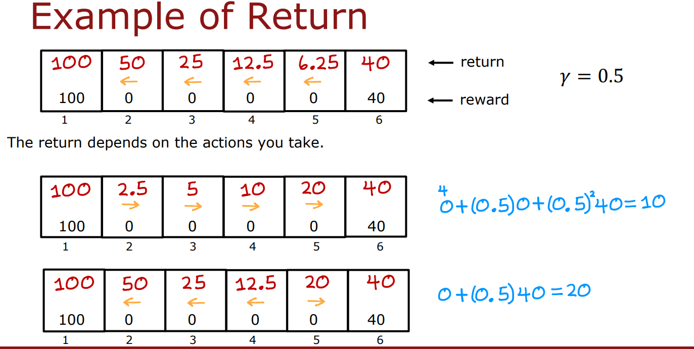
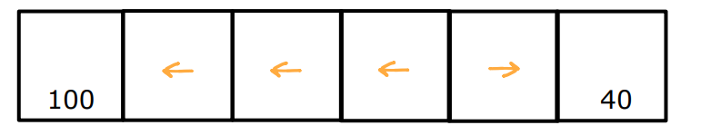

# week 3: Reinforcement learning
**learning objectives**
- Understand key terms such as **return**, **state**, **action**, and **policy** as they apply to reinforcement learning.
- Learn the **Bellman equations** and their significance in reinforcement learning.
- Explore the **state-action value function** and its role in decision-making.
- Understand how to handle **continuous state spaces** in reinforcement learning tasks.
- Build a **deep Q-learning network** to solve problems.

---

## Ch 1: Reinforcement learning introduction
**What is reinforcement learning?**
- RL focuses on training systems to make decisions based on rewards received for actions taken in various states..

- Unlike supervised learning, RL doesn't require labeled datasets (state-action pairs). Instead, it uses a reward system to learn optimal behavior.

- In machine learning, reinforcement
learning is one of those ideas that while not very widely applied in
commercial applications yet today, is one of the pillars of machine learning.

**Example**  
Let's take an autonomous helicopter as an example: 
check out the stanfrod autonomous helicopter flying videos [here.](http://heli.stanford.edu)  

#### Problem Setup:
The helicopter is equipped with:
- An onboard computer
- GPS, accelerometers, gyroscopes, and a magnetic compass for precise location and orientation tracking.

The **goal**: Given the helicopter’s position and state, determine how to move the control sticks to keep the helicopter balanced and flying without crashing.  

In reinforcement learning terms:
1. The **state** (\(s\)) includes the helicopter’s position, orientation, speed, etc.
2. The **action** (\(a\)) determines how far to push the control sticks.
3. The **reward function** measures the helicopter’s performance:
   - Rewards smooth flying.
   - Penalizes crashing or poor performance.

The task is to find a function that maps from the **state** of the helicopter (\(s\)) to an **action** (\(a\)), guided by the **reward function**, which encourages good behavior (e.g., stable flight) and discourages bad outcomes (e.g., crashes).

---
**Why Not Supervised Learning for RL?**  
- It Let's say we could get
a bunch of observations of states and maybe have an expert human pilot tell
us what's the best action y to take. You could then train a neural
network using supervised learning to directly learn the mapping from
the states s which I'm calling x here, to an action a which I'm
calling the label y here. But the problem is that when the helicopter
is moving through the air is actually very ambiguous, what is
the exact one right action to take.

-  One way to think of why
reinforcement learning is so powerful is you have to tell it what
to do rather than how to do it. And specifying the reward function rather
than the optimal action gives you a lot more flexibility in how
you design the system. Concretely for flying the helicopter,
whenever it is flying well, you may give it a reward of plus
one every second it is flying well. And maybe whenever it's flying poorly
you may give it a negative reward or if it ever crashes, you may give it a very
large negative reward like negative 1,000.

**Other applications of RL:**  
- **Factory Optimization**: Maximizing efficiency by rearranging workflows.
- **Financial Trading**: Optimizing stock trades to minimize market impact.
- **Game Playing**: From checkers and chess to Go and video games, RL has achieved remarkable success.  

<br/>
<br/>  

# Mars Rover Example: Reinforcement Learning Formalism

To complete our understanding of the reinforcement learning formalism, let’s explore a simplified example inspired by the Mars rover. This example, adapted from Stanford professor Emma Branskill and my collaborator Jagriti Agrawal (who has worked on controlling the actual Mars rover), will help us understand key reinforcement learning concepts.

---

## **The Problem Setup**
The Mars rover can occupy one of **six positions**, represented by six boxes:  

  
  <br/>
  <br/>

- The rover starts in **state 4** (the fourth box).
- The position of the rover is called the **state** in reinforcement learning.
- We label these positions as **state 1**, **state 2**, ..., **state 6**.
- the **state 1** and **state 6** are called **terminal states**  what that means is that, after it gets to one of
these terminals states, gets a reward at that state, but then nothing
happens after that.

The **goal** of the rover:
- Carry out science missions like:
  - Analyzing rock surfaces using sensors such as a drill, radar, or spectrometer.
  - Taking interesting pictures for scientists on Earth.

### **Rewards**
Each state has an associated **reward**:
- **State 1**: Reward = **100** (most valuable state for science).
- **State 6**: Reward = **40** (less valuable but still interesting).
- **States 2, 3, 4, and 5**: Reward = **0** (not much interesting science here).

---

## **Actions**
At every time step, the rover can take one of two actions:
1. **Go Left**
2. **Go Right**

The objective is to determine the best sequence of actions for the rover to maximize its reward.

---


## **Core Elements of Reinforcement Learning**
At every time step in reinforcement learning:
1. **State (S)**: The current state of the rover (e.g., state 4).  
2. **Action (A)**: The action chosen by the rover (e.g., go left or go right).  
3. **Reward (R(S))**: The reward associated with the current state (e.g., reward = 0 in state 4).  
4. **Next State (S')**: The new state the rover transitions to as a result of the action (e.g., state 3 after going left from state 4).  

These four components — **state**, **action**, **reward**, and **next state** — form the foundation of reinforcement learning algorithms. They guide the decision-making process for taking actions.

### **Reward Formalism**
- The reward **R(S)** is tied to the **current state** (not the state the rover transitions to).
- For example:
  - At **state 4**, reward = 0.  
  - When moving to **state 3**, the reward associated with **state 4** remains 0.

---


### **Example: Moving Left**
If the rover starts in **state 4** and chooses to go **left**:
1. At **state 4**: Reward = 0  
2. At **state 3**: Reward = 0  
3. At **state 2**: Reward = 0  
4. At **state 1**: Reward = 100  

Upon reaching **state 1**, the day ends. In reinforcement learning, **state 1** is called a **terminal state**, meaning:
- The rover receives the reward associated with that state (100 in this case).
- The rover cannot take further actions after reaching this state (e.g., due to fuel or time constraints).

---

### **Example: Moving Right**
If the rover starts in **state 4** and chooses to go **right**:
1. At **state 4**: Reward = 0  
2. At **state 5**: Reward = 0  
3. At **state 6**: Reward = 40  

Upon reaching **state 6**, the day ends (another terminal state).

---

### **Wasting Time Example**
The rover could also follow an inefficient sequence of actions:
1. Start in **state 4**.
2. Go **right** to **state 5**: Reward = 0.  
3. Then go **left** back to **state 4**, **state 3**, and **state 2**, eventually reaching **state 1**: Reward = 100.

In this case, the rover wastes time and fuel by going back and forth. While this sequence is valid, it is not optimal.

---

## **how do you prevent wasting time?**
we prevent this using what we call **return** in RL.  
The **return** is the total reward accumulated over time, weighted by a discount factor, which accounts for how much future rewards are valued compared to immediate rewards.  
One analogy that you might find helpful to understand **return** is if you imagine you have a five-dollar
bill at your feet, you can reach down and pick up, or half an hour across town, you can walk half an hour and pick up a 10-dollar bill. Which one would you rather go after? Ten dollars is much better than five dollars, but if you need to walk for half an hour to go and get that 10-dollar bill, then maybe it'd be more convenient to just pick up the five-dollar bill instead.

### let's take the Mars Rover example: 
  
<br/>
<br/>

If starting from state
4 you go to the left, we saw that the
rewards you get would be zero on the first
step from state 4, zero from state 3, zero from state 2, and then 100 at state
1, the terminal state. 
The **return** is defined as the sum of these rewards, weighted by a **discount factor** (denoted by `γ` or "gamma"). This discount factor is a number slightly less than `1`. For example, let’s set `γ = 0.9`.
we start in state 4 with reward of $0$, plus zero (reward of state 3) times $γ$ wich is $0$, plus zero (reward of state 2) times $γ^2$ wich is $0$, plus $100$ (reward of state 1) times $γ^3$ wich is $72.9$

The return is calculated as:  

```math
G = R_1 + \gamma R_2 + \gamma^2 R_3 + \gamma^3 R_4 + \dots 
```
```math
G = 0 + 0.9 \cdot 0 + 0.9^2 \cdot 0 + 0.9^3 \cdot 100  
```
```math
G = 0 + 0 + 0 + 0.729 \cdot 100 = 72.9 
```

## General Return Formula

For any sequence of rewards:
```math
G = R_1 + \gamma R_2 + \gamma^2 R_3 + \dots + \gamma^{n-1} R_n
```

The discount factor $\gamma$  reflects impatience in reinforcement learning, where rewards obtained sooner contribute more to the return. In many reinforcement learning algorithms, a common choice for the discount factor will be a number pretty close to 1, like 0.9, or 0.99, or even 0.999.

---


## Evaluating Returns from Different States

Let’s consider starting from different states and always moving **left**:

| Starting State | Rewards Sequence | Discounted Return |
|----------------|------------------|-------------------|
| State 1        | 100              | 100               |
| State 2        | 0, 0, 100        | 50                |
| State 3        | 0, 0, 0, 100     | 25                |
| State 4        | 0, 0, 0, 0, 100  | 12.5              |

---

## Comparing Strategies: Moving Left vs. Moving Right

If the Mars Rover always moves **right** instead:
- Starting from **state 4**, the rewards are `0, 0, 40`.
- Using $\gamma = 0.5$:
  $$G = 0 + 0.5 \cdot 0 + 0.5^2 \cdot 40 = 10$$

| Starting State | Rewards Sequence | Discounted Return |
|----------------|------------------|-------------------|
| State 1        | 40               | 40                |
| State 2        | 0, 40            | 20                |
| State 3        | 0, 0, 40         | 10                |
| State 4        | 0, 0, 0, 40      | 5                 |

In this case, always moving left gives higher returns compared to always moving right.

---

## Mixed Strategy Example

Suppose we use a mixed strategy:
- Move **left** from states 2, 3, and 4.
- Move **right** from state 5.

The resulting returns are:
| State         | Rewards Sequence | Discounted Return |
|---------------|------------------|-------------------|
| State 1       | 100              | 100               |
| State 2       | 0, 0, 100        | 50                |
| State 3       | 0, 0, 0, 100     | 25                |
| State 4       | 0, 0, 0, 0, 100  | 12.5              |
| State 5       | 0, 40            | 20                |
| State 6       | 40               | 40                |

---

  


## Key Insights About Returns

1. **Discount Factor $\gamma$**:
   - Rewards closer to the current state contribute more to the return.
   - Common choices for $\gamma$: `0.9`, `0.99`, or `0.999`.

2. **Effect of Negative Rewards**:
   - Negative rewards (e.g., penalties) are discounted more if they occur later, encouraging actions that delay penalties.

3. **Real-World Implications**:
   - In finance, $\gamma$ models interest rates or the time value of money.
   - In reinforcement learning, $\gamma$ encourages faster reward accumulation.

---

## **Policy function $\pi$**

As we've seen, there are many different ways that you can take actions in the reinforcement learning problem. For example:

- We could decide to always go for the nearer reward: go left if the leftmost reward is nearer, or go right if the rightmost reward is nearer.
- Another way to choose actions is to always go for the larger reward.
- Alternatively, we could always go for the smaller reward (though this doesn’t seem like a good idea).
- Or, you could choose to go left unless you're just one step away from the lesser reward, in which case you go for that one.

In reinforcement learning, our goal is to come up with a function called a **policy** $\pi$, whose job is to take as input any state `s` and map it to some action `a` that it wants us to take. 

For example, for the policy below:

- If you're in **state 2**, the policy maps to the **left action**.
- If you're in **state 3**, the policy says **go left**.
- If you're in **state 4**, the policy also says **go left**.
- If you're in **state 5**, the policy says **go right**.

  


Formally, $\pi(s)$ tells us what action to take in a given state `s`.

The goal of reinforcement learning is to find a policy $\pi$ or $\pi(s)$ that tells you what action to take in every state in order to **maximize the return**.

