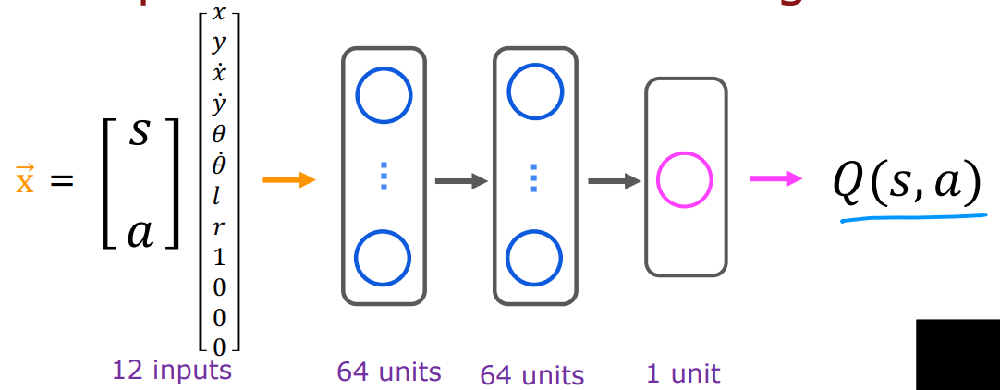

## Ch 3: Continuous state spaces

# Continuous State Spaces in Reinforcement Learning

Many robotic control applications involve **continuous state spaces**. Let’s explore what this means and how to generalize concepts from discrete states to continuous ones.

---

## Discrete vs. Continuous States

In the simplified Mars rover example, we used a **discrete set of states**, meaning the rover could only be in one of six possible positions. For example:
- The rover could be in **state 1, 2, 3, 4, 5, or 6**.

However, most robots can occupy a vast number of positions rather than just a small discrete set. Their positions are better represented as **continuous values**. For example:
- If the Mars rover can be anywhere along a line, its position might range from **0 to 6 kilometers**, and it could occupy **any value** within this range:
  - E.g., 2.7 km, 4.8 km, or any other decimal.

This is an example of a **continuous state space**, where the state is represented by a real-valued number.

---

## Example 1: Controlling a Car or Truck

Let’s consider a toy car or truck. If you are building a **self-driving car** and want it to drive smoothly, the state of the vehicle might include the following:

1. **Position**:
   - `x`: Its position along the horizontal axis.
   - `y`: Its position along the vertical axis.

2. **Orientation**:
   - $\theta$: The angle the car is facing (e.g., between $0^\circ$` and $360^\circ$ ).

3. **Velocities**:
   - $\dot{x}$: Speed in the `x`-direction.
   - $\dot{y}$: Speed in the `y`-direction.
   - $\dot{\theta}$: Angular velocity (rate at which the car is turning).

### Summary of Car State
For a car, the state is represented as a **vector** of six continuous numbers:
$$
[x, y, \theta, \dot{x}, \dot{y}, \dot{\theta}]
$$
Each of these values can take on a range of real numbers, such as:
- $\theta$: Ranges between $0^\circ$ and $360^\circ$.
- $\dot{\theta}$: Indicates whether the car is turning at 1°/s, 30°/s, or even 90°/s.

---

## Example 2: Controlling an Autonomous Helicopter

Now, let’s extend the concept to an **autonomous helicopter**. To control a helicopter, we need to capture both its position and orientation:

1. **Position**:
   - `x`: North-south position.
   - `y`: East-west position.
   - `z`: Height above the ground.

2. **Orientation**:
   - $\phi$: Roll (tilt left or right).
   - $\theta$: Pitch (tilt forward or backward).
   - $\psi$: Yaw (compass direction: north, east, south, or west).

3. **Velocities**:  
   - $\dot{x}, \dot{y}, \dot{z}$: Speeds in the x-, y-, and z-directions.
   - $\dot{\phi}, \dot{\theta}, \dot{\psi}$: Angular velocities (how quickly the roll, pitch, and yaw are changing).

### Summary of Helicopter State
For a helicopter, the state is represented as a **vector** of 12 continuous numbers:
$$
[x, y, z, \phi, \theta, \psi, \dot{x}, \dot{y}, \dot{z}, \dot{\phi}, \dot{\theta}, \dot{\psi}]
$$
Each of these values can take a range of real numbers.

---

## Continuous State Markov Decision Processes (MDPs)

In a **continuous state reinforcement learning problem**:
- The state isn’t just one of a small set of discrete values (e.g., 1-6 for the Mars rover).
- Instead, the state is a **vector** of continuous values, any of which can take on a large range of possible values.

This is referred to as a **continuous state Markov Decision Process (MDP)**.

---

# Lunar Lander Application in Reinforcement Learning

The **lunar lander** task is a classic example of a reinforcement learning problem, often used by researchers to test algorithms. In this task, the goal is to control a simulated lunar lander so that it can land safely on the moon's surface.

## Objective
In the lunar lander simulation, you are in charge of landing a spacecraft that is rapidly approaching the surface of the moon. Your task is to fire thrusters at the right moments to slow down and guide the lander to land between two flags on the landing pad.

### Successful Landing
A successful landing involves the lander firing thrusters downward, left, and right to position itself perfectly between two flags on the landing pad.

### Crash Scenario
On the other hand, if the reinforcement learning algorithm fails, the lander might crash, as shown here:

## Actions
There are four possible actions at each time step:
- **Nothing**: No action taken, and inertia and gravity pull the lander toward the surface.
- **Left**: Fire the left thruster to move the lander to the right.
- **Main**: Fire the main engine to slow the descent.
- **Right**: Fire the right thruster to move the lander to the left.

These actions are abbreviated as: **Nothing**, **Left**, **Main**, and **Right**.

## State Space
The state space of the lunar lander consists of several variables:
- **Position (X, Y)**: The lander's position on the horizontal (X) and vertical (Y) axes.
- **Velocity ($\dot{X}$, $\dot{Y}$)**: The speed of the lander along both axes.
- **Angle** $\Theta$: The lander's tilt or orientation.
- **Angular Velocity (Theta dot)**: The rate of change of the angle.
- **Leg Grounding (L, R)**: Indicates whether the left leg (L) or the right leg (R) is touching the ground. These are binary values (0 or 1).

## Reward Function
The lunar lander has a complex reward function designed to encourage safe landing and minimize fuel waste:
- **Landing on the pad**: Between +100 and +140 points depending on the precision of landing.
- **Moving toward the pad**: Positive reward for moving closer, negative reward for drifting away.
- **Crash**: Large penalty of -100 points for crashing.
- **Soft landing**: +100 points for landing softly (no crash).
- **Leg grounding**: +10 points for each leg grounded.
- **Fuel consumption**: Small penalties for firing thrusters (-0.3 for the main engine and -0.03 for the side thrusters).

This reward function is crucial because it guides the learning process of the agent.

## Reinforcement Learning Goal
The goal is to learn a policy **π** that, given a state **S**, picks an action **a** to maximize the return, which is the sum of discounted rewards. The **discount factor ($\gamma$)** is usually set to a high value (around **0.985**) to emphasize long-term rewards.

## Learning Algorithm
To solve this problem, we will use **deep reinforcement learning** and neural networks to develop a policy that can successfully land the lunar lander.

Let's see how we can use reinforcement learning to control the Lunar Lander or for other reinforcement learning problems. The key idea is that we're going to train a neural network to compute or to approximate the state-action value function $Q(s, a)$, which in turn will help us pick good actions.

## Neural Network Architecture

The heart of the learning algorithm is to train a neural network that inputs the current state and action and computes or approximates $Q(s, a)$. 

In particular, for the Lunar Lander, we will take the state ` s ` and any action ` a ` and put them together.

### State Representation

The state ` s ` consists of 8 values:

- ` x `, ` y ` (coordinates)
- $\dot{x}$, $\dot{y}$ (velocity)
- $\theta$, $\dot{\theta}$ (angle and angular velocity)
- LR (whether the landing legs are grounded)

### Action Representation

There are four possible actions: 
1. Do nothing 
2. Left thruster
3. Main engine
4. Right thruster

Each action is encoded using a one-hot vector. For example:
- Action 1 (nothing) is encoded as `[1, 0, 0, 0]`
- Action 2 (left) is encoded as `[0, 1, 0, 0]`, and so on.

Thus, the input to the neural network is a 12-dimensional vector: 8 for the state and 4 for the action encoding.

### Neural Network Structure
  

The neural network consists of:
- **Input Layer**: 12 features (state and action encoding)
- **Hidden Layers**: Two hidden layers with 64 units each
- **Output Layer**: A single output representing $Q(s, a)$

The job of the neural network is to output $Q(s, a)$, which is the state-action value for the Lunar Lander given the input state and action.

### Training the Neural Network

We'll train the network to approximate $Q(s, a)$ using Bellman’s equation:

$$
Q(s, a) = R(s) + \gamma \cdot \max_{a'} Q(s', a')
$$

Where:
- $R(s)$ is the reward for the state ` s `
- $\gamma$ is the discount factor
- $\max_{a'} Q(s', a')$ is the maximum future reward achievable from the next state ` s' `

This equation is used to create training examples from the Lunar Lander simulator.

### Generating the Training Set

We will perform the following steps:
1. **Interact with the environment**: Take random actions in the Lunar Lander, which gives us state-action-reward-next-state tuples ` (s, a, R(s), s') `.
2. **Generate Training Examples**:
   - For each tuple, the input ` x ` is ` (s, a) `, and the target ` y ` is calculated as:
   
   \[
   y = R(s) + \gamma \cdot \max_{a'} Q(s', a')
   \]

3. **Initial Random Q-Function**: Initially, the ` Q `-values are unknown, so the network guesses randomly. Over time, as we collect more experiences, the network will improve its estimates.

### Training Process

- After collecting a large number of experiences (e.g., 10,000), we create a dataset of ` (x, y) ` pairs.
- We use supervised learning to train the network by minimizing the mean squared error loss between the predicted ` Q(s, a) ` and the target value ` y `.

### Replay Buffer

We store the most recent 10,000 experiences in a **replay buffer**. This allows the network to learn from a diverse set of experiences, not just the most recent ones.

### Full Learning Algorithm

1. **Initialize the neural network**: Randomly initialize the weights and biases.
2. **Collect experiences**: Randomly interact with the environment to gather state-action-reward-next-state tuples.
3. **Store experiences**: Save the most recent 10,000 experiences.
4. **Train the network**: Create training sets from the replay buffer and train the neural network using supervised learning.

Through this iterative process, the neural network will improve its approximation of the state-action value function ` Q(s, a) `, leading to better decision-making in the Lunar Lander environment.

# Improved Neural Network Architecture for DQN

## Modified Neural Network Architecture

Here’s the modified neural network architecture:

- **Input**: 8 numbers corresponding to the state of the lunar lander.
- **Hidden Layers**: 64 units in the first hidden layer and 64 units in the second hidden layer.
- **Output Layer**: 4 output units.

The job of the neural network is to compute simultaneously the ` Q `-values for all four possible actions in state ` s `:
- $Q(s, \text{nothing})$
- $Q(s, \text{left})$
- $Q(s, \text{main})$
- $Q(s, \text{right})$

This is more efficient because, given the state ` s`, we can run inference just once and get all four of these values. We can then quickly pick the action ` a` that maximizes ` Q(s, a)`.

### Bellman’s Equation Efficiency

Notice also that in Bellman’s equation, there's a step in which we need to compute:

$$
\max_{a'} Q(s', a') \cdot \gamma + R(s)
$$

This neural network architecture makes it much more efficient to compute this because we get all ` Q(s', a')` values for all actions ` a'` at the same time. We can then simply pick the maximum to compute the value for the right-hand side of Bellman’s equation.

# $\epsilon$-gready policy

The learning algorithm that we developed, even while you're still learning how to approximate `Q(s,a)`, you need to take some actions in the lunar lander. How do you pick those actions while you're still learning? The most common way to do so is to use something called an Epsilon-greedy policy. Let's take a look at how that works.

### The Algorithm
One of the steps in the algorithm is to take actions in the lunar lander. When the learning algorithm is still running, we don't really know what's the best action to take in every state.how do we take actions in this step of the learning algorithm? Let's look at some options.

- #### Option 1
When you're in some state s, we might not want to take actions totally at random because that will often be a bad action. One natural option would be to pick, whenever in state s, pick an action a that maximizes `Q(s,a)`. We may say, even if `Q(s,a)` is not a great estimate of the Q function, let's just do our best and use our current guess of `Q(s,a)` and pick the action a that maximizes it. It turns out this may work okay, but isn't the best option.

- #### Option 2
Instead, here's what is commonly done. Here's option 2, which is most of the time, let's say with probability of $0.95$, pick the action that maximizes `Q(s,a)`. Most of the time we try to pick a good action using our current guess of `Q(s,a)`. But the small fraction of the time, let's say, $5\%$ of the time, we'll pick an action a randomly.

#### Why Do We Want to Occasionally Pick an Action Randomly?
- Well, here's why. Suppose there's some strange reason that `Q(s,a)` was initialized randomly so that the learning algorithm thinks that firing the main thruster is never a good idea. Maybe the neural network parameters were initialized so that Q(s, main) is always very low. If that's the case, then the neural network, because it's trying to pick the action a that maximizes `Q(s,a)`, it will never ever try firing the main thruster. Because it never ever tries firing the main thruster, it will never learn that firing the main thruster is actually sometimes a good idea.

- Under option 2, on every step, we have some small probability of trying out different actions so that the neural network can learn to overcome its own possible preconceptions about what might be a bad idea that turns out not to be the case.

- This idea of picking actions randomly is sometimes called an exploration step. Because we're going to try out something that may not be the best idea, but we're going to just try out some action in some circumstances, explore and learn more about an action in the circumstance where we may not have had as much experience before.

- Taking an action that maximizes `Q(s,a)`, sometimes this is called a greedy action because we're trying to actually maximize our return by picking this. Or in the reinforcement learning literature, sometimes you'll also hear this as an exploitation step. I know that exploitation is not a good thing, nobody should ever explore anyone else. But historically, this was the term used in reinforcement learning to say, let's exploit everything we've learned to do the best we can.

- In the reinforcement learning literature, sometimes you hear people talk about the exploration versus exploitation trade-off, which refers to how often do you take actions randomly or take actions that may not be the best in order to learn more, versus trying to maximize your return by say, taking the action that maximizes `Q(s,a)`.

- This approach, that is option 2, has a name, is called an Epsilon-greedy policy, where here Epsilon is 0.05 is the probability of picking an action randomly. This is the most common way to make your reinforcement learning algorithm explore a little bit, even whilst occasionally or maybe most of the time taking greedy actions.

### Start with High Epsilon
Lastly, one of the tricks that's sometimes used in reinforcement learning is to start off Epsilon high. Initially, you are taking random actions a lot at a time and then gradually decrease it, so that over time you are less likely to take actions randomly and more likely to use your improving estimates of the `Q-function` to pick good actions. For example, in the lunar lander exercise, you might start off with Epsilon very, very high, maybe even Epsilon equals $1.0$. You're just picking actions completely at random initially and then gradually decrease it all the way down to say $0.01$, so that eventually you're taking greedy actions $99\%$ of the time and acting randomly only a very small one percent of the time.